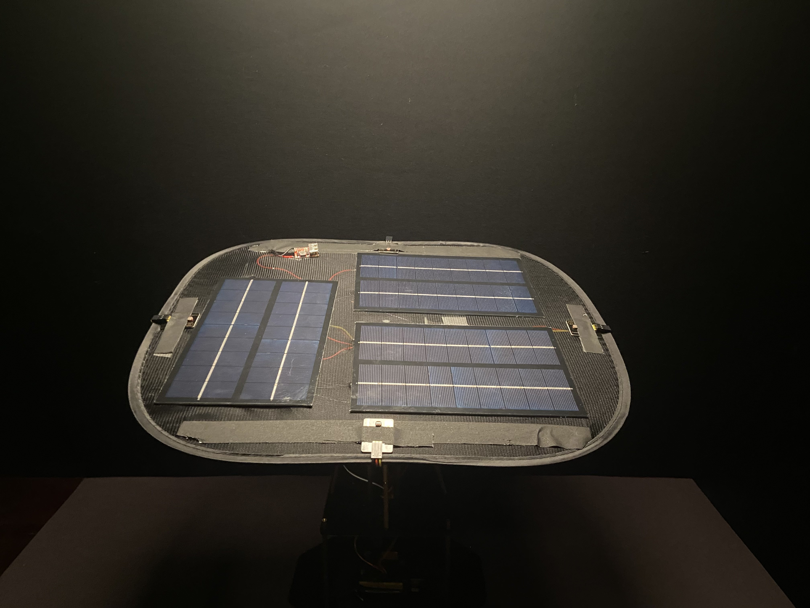

# Solar Tracker
My project is the Solar Tracker, a device that can rotate a solar panel to the position where the sunlight is brightest. This was achieved through photoresistors placed around the sides of the device and two servos for rotating and tilting the solar panels.

| **Engineer** | **Education** | **Area of Interest** |
|:--:|:--:|:--:|:--:|
| Christopher D | Senior, Carrboro High School | Civil/Environmental Engineering 



# Final Milestone
After sucessfuly installing the solar panel array, rebuilding the base to be stronger, and reworking the code, I completed my version of the Solar Tracker. Over the course, my biggest challenges were (1) how it would only rotate between two angles, (2) the extra sensors were unnecessary and draining power, (3) multiple code versions had to be tested and changed, (4) the solar panel array was too large for the original setup, and (5) the original servo motors were not strong enough to hold the weight of the solar panel array. 
To improve on this, I (1) used all four photoresistors to determine the best lighting position, (2) removed the extra sensors and related code, (3) reworked and adjusted that code for different setups, (4) increased the strength and stability of the base, and (5) replaced the original servo motors with higher torque servo motors.

I learned Arduino and can now use the program to manipulate robots and analyze code. Also, I improved my skills in electrical and mechanical engineering which will be useful in my future career as an engineer.

<iframe width="630" height="354.375" src="https://www.youtube.com/embed/LxID3AmDW9c" title="YouTube video player" frameborder="0" allow="accelerometer; autoplay; clipboard-write; encrypted-media; gyroscope; picture-in-picture; web-share" allowfullscreen></iframe>

 
# Second Milestone
Regarding the code for the Solar Tracker, I chose to go for an approach which made use of all 4 photoresistors and compared their values to rotate to the correct position. This had more success than previously, but still needed some adjustments to the code and photoresistor placement. Originally, the photoresistors were in a fixed position on the base of the Solar Tracker, but in the new version, they would be placed on the edges of the solar panel array. This would allow the code to better adjust to light changes as the photoresistor values would also be changing when the solar panel array rotated. The code has been the largest problem so far, but I am confident it will work.

When the servos would rotate the solar panel, the whole project would shake as it made large turns/tilts. The structure of the Solar Tracker needed to be disassembled and rebuilt to create a taller and more stable base that allows the solar panel array to rotate fully. The wires and copper pillars were extended to accommodate for the height, and a larger backboard was added behind the solar panel array to have a stabler hold for the servos.

<iframe width="630" height="354.375" src="https://www.youtube.com/embed/Y3H3McWRSUs" title="YouTube video player" frameborder="0" allow="accelerometer; autoplay; clipboard-write; encrypted-media; gyroscope; picture-in-picture; web-share" allowfullscreen></iframe>

 
# First Milestone
I wanted the Solar Tracker to be able to rotate to the strongest source of light. I started with the solar panel, two servo motors, light intensity meter, photoresistors, and the Arduino Uno. The Arduino Uno will  adjust the solar panel after reading and comparing the values given by the photoresistors and light intensity meter.

After assembling the servos together and situating the photoresistors on the sides of the solar panel, the code I had started with split rotation and tilt into two functions - one done by the side photoresistors and the other done by the vertical photoresistors. This method seemed inefficient because the solar panel would only rotate 180 degrees and wasn’t tilting at all. This was the main problem I encountered when creating the Solar Tracker and will be one of the focuses of the Second Milestone.

<iframe width="630" height="354.375" src="https://www.youtube.com/embed/y-rF2BesrVY" title="YouTube video player" frameborder="0" allow="accelerometer; autoplay; clipboard-write; encrypted-media; gyroscope; picture-in-picture; web-share" allowfullscreen></iframe>

 
# Schematics 
Here is the self-made circuitry schematic: (Made with TinkerCad)


 
# Code

```c++
/*
 * ChrisD_SolarTracker
 */

// include Servo library
#include <Servo.h>

// horizontal servo
Servo horizontal;
int servoh = 90;

int servohLimitHigh = 350;
int servohLimitLow = 0;

Servo vertical;
int servov = 100;

int servovLimitHigh = 235;
int servovLimitLow = 55;

// LDR pin connections
int ldrTR = A2; // LDR top right
int ldrTL = A1; // LDR top left
int ldrBR = A3; // LDR bottom right
int ldrBL = A0; // LDR bottom left

void setup() {
  Serial.begin(9600);
  // servo connections
  horizontal.attach(9);
  vertical.attach(10);
  // move servos
  horizontal.write(90);
  vertical.write(90);
  delay(3000);
}

void loop() {

  int tr = analogRead(ldrTR); // top right
  int tl = analogRead(ldrTL); // top left
  int br = analogRead(ldrBR); // bottom right
  int bl = analogRead(ldrBL); // bottom left

  int dtime = 0; // change for debugging only
  int tol = 50;

  int avt = (tl + tr) / 2; // average value top
  int avd = (bl + br) / 2; // average value bottom
  int avl = (tl + bl) / 2; // average value left
  int avr = (tr + br) / 2; // average value right

  int dvert = avt - avd;  // check the difference of up and down
  int dhoriz = avl - avr; // check the difference of left and right

  // send data to the serial monitor if desired
  Serial.print(tl);
  Serial.print(" ");
  Serial.print(tr);
  Serial.print(" ");
  Serial.print(bl);
  Serial.print(" ");
  Serial.print(br);
  Serial.print("  ");
  Serial.print(avt);
  Serial.print(" ");
  Serial.print(avd);
  Serial.print(" ");
  Serial.print(avl);
  Serial.print(" ");
  Serial.print(avr);
  Serial.print("  ");
  Serial.print(dtime);
  Serial.print("   ");
  Serial.print(tol);
  Serial.print("  ");
  Serial.print(servov);
  Serial.print("   ");
  Serial.print(servoh);
  Serial.println(" ");


  // check if the difference is in the tolerance else change vertical angle
  if (-1 * tol > dvert || dvert > tol) {
    if (avt > avd) {
      servov = ++servov;
      if (servov > servovLimitHigh) {
        servov = servovLimitHigh;
      }
    }
    else if (avt < avd) {
      servov = --servov;
      if (servov < servovLimitLow) {
        servov = servovLimitLow;
      }
    }
    vertical.write(servov);
  }

  // check if the difference is in the tolerance else change horizontal angle
  if (-1 * tol > dhoriz || dhoriz > tol) {
    if (avl > avr) {
      servoh = --servoh;
      if (servoh < servohLimitLow) {
        servoh = servohLimitLow;
      }
    }
    else if (avl < avr) {
      servoh = ++servoh;
      if (servoh > servohLimitHigh) {
        servoh = servohLimitHigh;
      }
    }
    else if (avl = avr) {
      // nothing
    }
    horizontal.write(servoh);
  }
  
  delay(dtime);
  
}
```
 
# Bill of Materials
Here are the parts used to assemble the Solar Tracker. Separated into two tables, the parts necessary for the basic solar tracker kit are listed first, while the parts that I improved on or added are listed in the latter table.

| **Core Part** | **Description** | **Price** | **Link** |
|:--:|:--:|:--:|:--:|
| Acrylic Board | Holds the Arduino Uno and creates structure to stabilize motion | $5.84 | <a href="https://www.amazon.com/piece12-Plexiglass-8ThickTransparent-Protective-Sheeting/dp/B0B134CQF1/ref=sr_1_9?crid=18KOGASTTVO8X&keywords=small%2Bacrylic%2Bboard&qid=1687310250&sprefix=smallacrylic%2Bboard%2Caps%2C102&sr=8-9&th=1"> Link </a> |
|:--:|:--:|:--:|:--:|
| Arduino UNO REV3 | Controlls and executes the code uploaded to it | $24.49	 | <a href="https://www.amazon.com/Arduino-A000066-ARDUINO-UNO-R3/dp/B008GRTSV6"> Link </a> |
|:--:|:--:|:--:|:--:|
| M3 8MM Flat Head Screws | Holds copper pillars together and creates structure | $7.99 | <a href="https://www.amazon.com/Uxcell-a15101300ux0191-Phillips-Countersunk-Machine/dp/B018RSV2AI/ref=sr_1_4?crid=3OU8E5K7K1LE9&keywords=m3+8mm+flat+head&qid=1687310558&sprefix=m3+8mm+flat+hea%2Caps%2C155&sr=8-4"> Link </a> |
|:--:|:--:|:--:|:--:|
| Photoresistor | Measures strength of light hitting it | $1.59 | <a href="https://www.amazon.com/Gowoops-Digital-Intensity-Detection-Photosensitive/dp/B01N1FKS4L/ref=sr_1_3?crid=1DIUSQ924HBXW&keywords=photoresistor+module&qid=1687309420&s=industrial&sprefix=photoresistor+module%2Cindustrial%2C78&sr=1-3"> Link </a> |
|:--:|:--:|:--:|:--:|
| 205mm 1 Pin Female-Female Wire | Connects photoresitors to Arduino Uno | $0.48 | <a href="https://www.amazon.com/uxcell-Female-Jumper-2-54mm-Breadboard/dp/B07FM72VBF/ref=sr_1_21?crid=PVMBH3UEZZGG&keywords=female+to+female+header+wires&qid=1687309670&sprefix=female+to+female+header+wire%2Caps%2C194&sr=8-21"> Link </a> |
|:--:|:--:|:--:|:--:|
| Solar Panel | Converts light into electrcity through the photoelectric effect | $4.66 | <a href="https://www.amazon.com/Treedix-Polysilicon-Polycrystalline-Encapsulated-Waterproof/dp/B08332319P/ref=sr_1_15?crid=12C9TWE8ARSZQ&keywords=mini+solar+cell&qid=1687309908&sprefix=mini+solar+cell%2Caps%2C157&sr=8-15"> Link </a> |
|:--:|:--:|:--:|:--:|
| Servo Motor	| Controls the vertical and horizontal rotation of the solar panel array | $4.89 | <a href="https://www.amazon.com/SIPYTOPF-Digital-Helicopter-Airplane-Control/dp/B0BNYMW9S9/ref=sr_1_8?keywords=mg995+servo&qid=1687891607&sprefix=mg995%2Caps%2C89&sr=8-8"> Link </a> |
|:--:|:--:|:--:|:--:|
| Servo Mount Kit | Places servos in correct locations to allow for both axises of motion | $6.49 | <a href="https://www.amazon.com/Servo-Mount-Bracket-MG996R-Steering/dp/B07PQ12TXS/ref=pd_vtp_h_pd_vtp_h_sccl_2/142-5183585-0614457?pd_rd_w=ODKxF&content-id=amzn1.sym.a5610dee-0db9-4ad9-a7a9-14285a430f83&pf_rd_p=a5610dee-0db9-4ad9-a7a9-14285a430f83&pf_rd_r=CMS6YGJD80733AK18S3W&pd_rd_wg=vFWNp&pd_rd_r=d08cd38a-b95c-467d-9edf-a2cafc14b2b0&pd_rd_i=B07PQ12TXS&psc=1"> Link </a> |

| **Modification Part** | **Description** | **Price** | **Link** |
|:--:|:--:|:--:|:--:|
| M3 45MM Copper Pillar | Allows for a taller base and creates structure | $3.24 | <a href="https://www.amazon.com/SUOFEILAIMU-PHONE-CASE-Standoffs-Hexagonal-M34-60mm/dp/B09C47BMF7/ref=sr_1_17?crid=3IU0RWE4M95DG&keywords=m3%2B45MM%2Bcopper%2Bpillar&qid=1687310418&sprefix=m3%2B45mm%2Bcopper%2Bpillar%2Caps%2C114&sr=8-17&th=1"> Link </a> |
|:--:|:--:|:--:|:--:|
| 500mm 1 Pin Male-Female Wire | Extends connection length to allow for a taller base | $0.31 | <a href="https://www.amazon.com/uxcell-Female-Jumper-2-54mm-Breadboard/dp/B07GN85RC2/ref=sr_1_4?crid=3J9MVFQG161AH&keywords=long+header+wires&qid=1687287588&sprefix=long+header+wire%2Caps%2C121&sr=8-4"> Link </a> |
